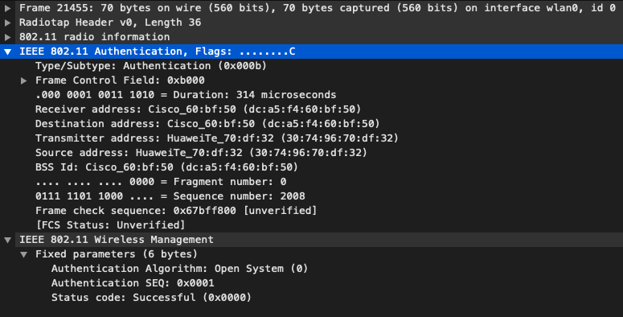

- [Livrables](#livrables)

- [Échéance](#%c3%89ch%c3%a9ance)

- [Quelques éléments à considérer](#quelques-%c3%a9l%c3%a9ments-%c3%a0-consid%c3%a9rer-pour-les-parties-2-et-3)

- [Travail à réaliser](#travail-%c3%a0-r%c3%a9aliser)

# Sécurité des réseaux sans fil

## Laboratoire 802.11 Sécurité WPA Entreprise

__A faire en équipes de deux personnes__

### Objectif :

1.	Analyser les étapes d’une connexion WPA Entreprise avec une capture Wireshark
2.	__(optionnel)__ Implémenter une attaque WPE (Wireless Pwnage Edition) contre un réseau WPA Entreprise
1.  __(optionnel)__ Implémenter une attaque GTC Dowgrade contre un réseau WPA Entreprise


## Quelques éléments à considérer pour les parties 2 et 3 :

Les parties 2 et 3 sont optionnelles puisque vous ne disposez pas forcement du matériel nécessaire pour les réaliser.

En principe, il devrait être possible de démarrer vos machines en Kali natif (à partir d'une clé USB, avec une distro live par exemple) ou d'employer une autre version de Linux. Si vous n'avez pas une interface WiFi USB externe, __vous ne pouvez pas faire ces parties dans une VM Linux__. 

Dans le cas où vous arriverais à tout faire pour démarrer un Linux natif, il existe toujours la possibilité que votre interface WiFi ne puisse pas être configurée en mode AP, ce qui à nouveau empêche le déroulement des parties 2 e 3.

Ces deux parties sont vraiment intéressantes et __je vous encourage à essayer de les faire__, si vous avez les ressources. Malheureusement je ne peux pas vous proposer un bonus si vous les faites, puisqu'il risque d'y avoir des personnes qui n'auront pas la possibilité de les réaliser pour les raisons déjà expliquées.

Si toutes les équipes rendent le labo complet, il sera donc corrigé entièrement et les parties 2 et 3 seront considérées pour la note.

Si vous vous lancez dans ces deux parties, voici quelques informations qui peuvent vous aider :

- Solution à l’erreur éventuelle « ```Could not configure driver mode``` » :

```
nmcli radio wifi off
rfkill unblock wlan
```
-	Pour pouvoir capturer une authentification complète, il faut se déconnecter d’un réseau et attendre 1 minute (timeout pour que l’AP « oublie » le client) 
-	Les échanges d’authentification entreprise peuvent être facilement trouvés utilisant le filtre d’affichage « ```eap``` » dans Wireshark


## Travail à réaliser

### 1. Analyse d’une authentification WPA Entreprise

Dans cette première partie, vous allez analyser [une connexion WPA Entreprise](files/auth.pcap) avec Wireshark et fournir des captures d’écran indiquant dans chaque capture les données demandées.

- Comparer [la capture](files/auth.pcap) au processus d’authentification donné en théorie (n’oubliez pas les captures d'écran pour illustrer vos comparaisons !). En particulier, identifier les étapes suivantes :
	- Requête et réponse d’authentification système ouvert
 	- Requête et réponse d’association (ou reassociation)
	- Négociation de la méthode d’authentification entreprise
	- Phase d’initiation. Arrivez-vous à voir l’identité du client ?
	- Phase hello :
		- Version TLS
		- Suites cryptographiques et méthodes de compression proposées par le client et acceptées par l’AP
		- Nonces
		- Session ID
	- Phase de transmission de certificats
	 	- Echanges des certificats
		- Change cipher spec
	- Authentification interne et transmission de la clé WPA (échange chiffré, vu comme « Application data »)
	- 4-way handshake

### Répondez aux questions suivantes :
 
> **_Question :_** Quelle ou quelles méthode(s) d’authentification est/sont proposé(s) au client ?
> 
> **_Réponse :_** Les méthodes proposés au client sont EAP TLS puis PEAP car le client refuse la première methode

---

> **_Question:_** Quelle méthode d’authentification est finalement utilisée ?
> 
> **_Réponse:_** Le client accepte la méthode PEAP

---

> **_Question:_** Lors de l’échange de certificats entre le serveur d’authentification et le client :
> 
> - a. Le serveur envoie-t-il un certificat au client ? Pourquoi oui ou non ?
> 
> **_Réponse:_** Oui le serveur envoi toujours un certificate au client peu importe la méthode qui utilise TLS.
> 
> - b. Le client envoie-t-il un certificat au serveur ? Pourquoi oui ou non ?
> 
> **_Réponse:_** Non car PEAP ne demande pas de certificate au client pour s'authentifié au près du serveur.
> 

---

### Capture des trames et explications

#### Système ouvert



*Opensystem Request (Client -> AP)*


*Opensystem Response (Client <- AP)*

#### (Re)Association

Dans le cas précis, on observe une **ré**association de l'utilisateur, indiquant qu'il connaissait déjà le réseau en question.


*(Re)association Request (Client -> AP)*


*(Re)association Response (Client <- AP)*

#### Phase d'initiation

*Arrivez-vous à voir l’identité du client ?*
- Oui, le client ne s'identifie pas de manière anonyme, son identifiant est "joel.gonin" dans le domaine "einet".


*Identity Request (Client <- AP)*


*Inidentity Response (Client -> AP)*

**Différences avec la théorie:**

- La demande d'identification n'est pas détaillée dans la théorie, mais nous savons qu'une première identification est demandée avant l'authentification.

#### Négociation de la méthode

L'AP propose en premier lieu l'utilisation de EAP-TLS, ce que refuse le client.
L'AP propose alors EAP-PEAP, ce que le client accepte finalement tacitement, en poursuivant la séquence.


*Request TLS EAP (Client <- AP)*


*Response Legacy NAK (Client -> AP)*


*Request Protected EAP (Client <- AP)*

**Différences avec la théorie:**

- La théorie ne définit simplement pas la négociation de la méthode.

#### Phase hello

Acceptation de la méthode et suite en séquence du protocole d'authentification.


*Hello (Client -> AP)*

Propositions du clients :
- Version TLS : 1.2
- Suites cryptographiques et méthodes de compression :
    - Aucune méthode de compression n'est proposée (`NULL`).
    - Suites cryptographiques :
    ```default
    Cipher Suite: TLS_ECDHE_ECDSA_WITH_AES_256_GCM_SHA384 (0xc02c)
    Cipher Suite: TLS_ECDHE_RSA_WITH_AES_256_GCM_SHA384 (0xc030)
    Cipher Suite: TLS_DHE_RSA_WITH_AES_256_GCM_SHA384 (0x009f)
    Cipher Suite: TLS_ECDHE_ECDSA_WITH_AES_128_GCM_SHA256 (0xc02b)
    Cipher Suite: TLS_ECDHE_RSA_WITH_AES_128_GCM_SHA256 (0xc02f)
    Cipher Suite: TLS_DHE_RSA_WITH_AES_128_GCM_SHA256 (0x009e)
    Cipher Suite: TLS_ECDHE_ECDSA_WITH_CHACHA20_POLY1305_SHA256 (0xcca9)
    Cipher Suite: TLS_ECDHE_RSA_WITH_CHACHA20_POLY1305_SHA256 (0xcca8)
    Cipher Suite: TLS_ECDHE_ECDSA_WITH_AES_256_CBC_SHA (0xc00a)
    Cipher Suite: TLS_ECDHE_ECDSA_WITH_AES_256_CBC_SHA384 (0xc024)
    Cipher Suite: TLS_ECDHE_RSA_WITH_AES_256_CBC_SHA (0xc014)
    Cipher Suite: TLS_ECDHE_RSA_WITH_AES_256_CBC_SHA384 (0xc028)
    Cipher Suite: TLS_DHE_RSA_WITH_AES_256_CBC_SHA (0x0039)
    Cipher Suite: TLS_DHE_RSA_WITH_AES_256_CBC_SHA256 (0x006b)
    Cipher Suite: TLS_ECDHE_ECDSA_WITH_AES_128_CBC_SHA (0xc009)
    Cipher Suite: TLS_ECDHE_ECDSA_WITH_AES_128_CBC_SHA256 (0xc023)
    Cipher Suite: TLS_ECDHE_RSA_WITH_AES_128_CBC_SHA (0xc013)
    Cipher Suite: TLS_ECDHE_RSA_WITH_AES_128_CBC_SHA256 (0xc027)
    Cipher Suite: TLS_DHE_RSA_WITH_AES_128_CBC_SHA (0x0033)
    Cipher Suite: TLS_DHE_RSA_WITH_AES_128_CBC_SHA256 (0x0067)
    Cipher Suite: TLS_ECDHE_ECDSA_WITH_RC4_128_SHA (0xc007)
    Cipher Suite: TLS_ECDHE_RSA_WITH_RC4_128_SHA (0xc011)
    Cipher Suite: TLS_RSA_WITH_AES_256_GCM_SHA384 (0x009d)
    Cipher Suite: TLS_RSA_WITH_AES_128_GCM_SHA256 (0x009c)
    Cipher Suite: TLS_RSA_WITH_AES_256_CBC_SHA (0x0035)
    Cipher Suite: TLS_RSA_WITH_AES_256_CBC_SHA256 (0x003d)
    Cipher Suite: TLS_RSA_WITH_AES_128_CBC_SHA (0x002f)
    Cipher Suite: TLS_RSA_WITH_AES_128_CBC_SHA256 (0x003c)
    Cipher Suite: TLS_RSA_WITH_RC4_128_SHA (0x0005)
    Cipher Suite: TLS_RSA_WITH_RC4_128_MD5 (0x0004)
    Cipher Suite: TLS_RSA_WITH_3DES_EDE_CBC_SHA (0x000a)
  
    Signature Algorithm: rsa_pkcs1_sha512 (0x0601)
    Signature Algorithm: ecdsa_secp521r1_sha512 (0x0603)
    Signature Algorithm: rsa_pkcs1_sha384 (0x0501)
    Signature Algorithm: ecdsa_secp384r1_sha384 (0x0503)
    Signature Algorithm: rsa_pkcs1_sha256 (0x0401)
    Signature Algorithm: ecdsa_secp256r1_sha256 (0x0403)
    Signature Algorithm: SHA224 RSA (0x0301)
    Signature Algorithm: SHA224 ECDSA (0x0303)
    Signature Algorithm: rsa_pkcs1_sha1 (0x0201)
    Signature Algorithm: ecdsa_sha1 (0x0203)
    ```
- Nonces : `955bf5b716e24a729c4b60609b8ce482014ac38f1e9cb8cf2bf8fd30bf8995f1`
- Session ID : `9f1bbf1e90b88366a836db08d659f906a637ac31920e06f622762ca6c522a64f`


#### Phase de transmission de certificats et change cipher spec


*Server Hello, Certificate, Server Hello Done (Client <- AP)*

Choix de l'AP :
- Suite cryptographique et méthodes de compression:
    - Aucune méthode ne sera utilisée (`NULL`).
    - Suite cryptographique :
        ```Cipher Suite: TLS_RSA_WITH_AES_256_CBC_SHA```
- Nonces : `003b6c26003b6c2676ffd79814e56c065e5b0c39cb26600148ca1e9b3e8af83426d46e11`


*TLS change cipher spec (Client <- AP)*


*Response Protected EAP (Client -> AP)*

**Différences avec la théorie:**

- Dans la théorie, on la transmission de plusieurs messages distincts alors que dans le cas de cette capture, un seul paquet cumule les fonctions de plusieurs messages.
- On obsere également que l'AP prend l'initiative d'immédiatement démarrer la communication chiffrée.
- Le client ne fait finalement qu'accepter (après vérifications) la spécification, sans envoyer lui-même le message `TLS change cipher spec` comme présenté dans la théorie.

#### Auth interne


*Extrait d'une communication chiffrée de 7 paquets entre client et AP*

Liste des messages (supposée, vis-à-vis de la théorie):
1. Request Identity
2. Response Identity
3. Request Challenge
4. Response Challenge
5. Request Success
6. Response ACK 
7. TLS Tunnel Down


*Response Protected EAP (Client -> AP)*


*Success (Client <- AP)*

**Différences avec la théorie:**

- Les deux derniers messages (du client et de l'AP) ne sont pas décrits dans la théorie. 
    Ils semble simplement cloturer l'authentification TLS et initier le 4-way handshake

#### 4-way handshake


*Message 1 (Client <- AP)*


*Message 2 (Client -> AP)*


*Message 3 (Client <- AP)*


*Message 4 (Client -> AP)*


## Livrables

Un fork du repo original . Puis, un Pull Request contenant :

-	Captures d’écran + commentaires
-	Réponses aux questions

## Échéance

Le 1 juin 2020 à 23h59